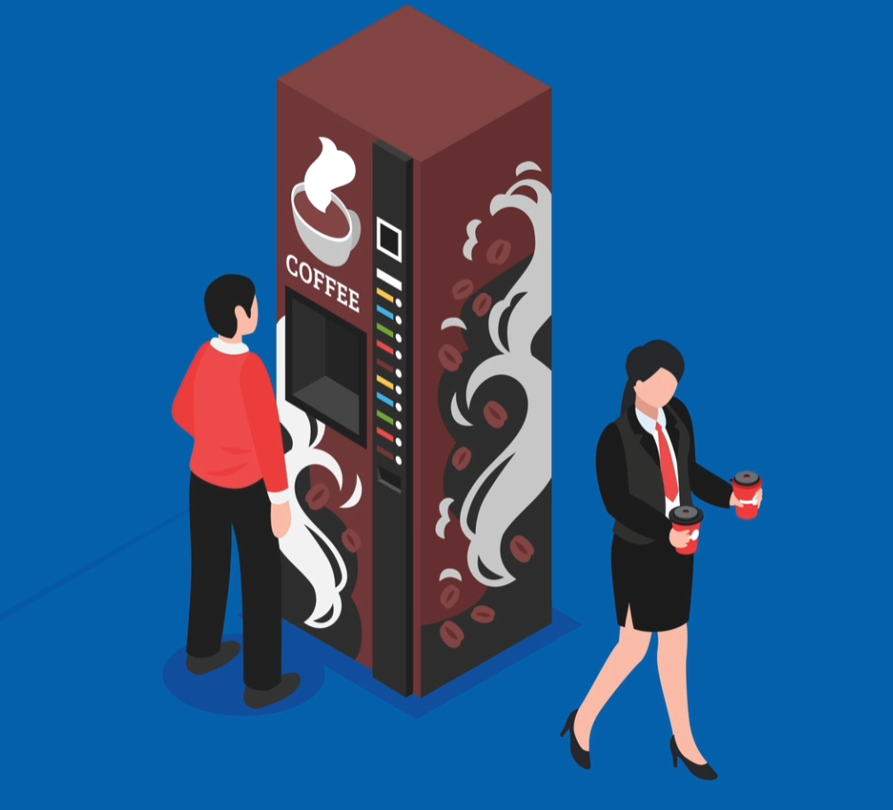

[![Contributors][contributors-shield]][contributors-url]
[![Forks][forks-shield]][forks-url]
[![Stargazers][stars-shield]][stars-url]
[![Issues][issues-shield]][issues-url]
[![MIT License][license-shield]][license-url]
[![LinkedIn][linkedin-shield]][linkedin-url]

<!-- PROJECT LOGO -->
 

  

<h3 align="center">COFFEE MACHINE </h3>

  

    The Coffee Machine Simulator is a Python-based project that simulates the functionality of a coffee machine. This project leverages Object-Oriented Programming (OOP) principles to create a user-friendly and interactive application that allows users to make various coffee drinks.
     
    <a href="https://github.com/senabibi/Coffee_Machine"><strong>Explore the docs »</strong></a>
     
     
    <a href="https://github.com/senabibi/Coffee_Machine">View Demo</a>
    ·
    <a href="https://github.com/senabibi/Coffee_Machine/issues">Report Bug</a>
    ·
    <a href="https://github.com/senabibi/Coffee_Machine/issues">Request Feature</a>
  

<!-- TABLE OF CONTENTS -->

  
Table of Contents

  <ol>
    <li>
      <a href="#about-the-project">About The Project</a>
      <ul>
        <li><a href="#built-with">Built With</a></li>
      </ul>
    </li>
    <li>
      <a href="#getting-started">Getting Started</a>
      <ul>
        <li><a href="#prerequisites">Prerequisites</a></li>
        <li><a href="#installation">Installation</a></li>
      </ul>
    </li>
    <li><a href="#usage">Usage</a></li>
    <li><a href="#roadmap">Roadmap</a></li>
    <li><a href="#contributing">Contributing</a></li>
    <li><a href="#license">License</a></li>
    <li><a href="#contact">Contact</a></li>
    <li><a href="#acknowledgments">Acknowledgments</a></li>
  </ol>

## About The Project

Here's a video demonstrating the Coffee Machine Simulator in action:

)

The Coffee Machine Simulator is a Python-based project that emulates the operation of a coffee machine. It allows users to choose from a selection of coffee types, enter the amount of money they want to spend, and, if there are sufficient ingredients in the machine, it prepares the selected coffee and provides change. If the machine is low on any ingredient, it prompts the user to refill the necessary supplies.

Additionally, users can request a report to check the current status of the machine, including the remaining quantities of each ingredient.

This project demonstrates the principles of Object-Oriented Programming (OOP) and provides a user-friendly and interactive experience for coffee enthusiasts.

(<a href="#readme-top">back to top</a>)

### Built With

* [![Python][Python.py]][Python-url]
* [![Replit][Replit.com]][Replit-url]

(<a href="#readme-top">back to top</a>)

## Getting Started

This section provides instructions on how to set up and run the project locally. Please follow these steps to get your environment ready.

### Prerequisites

Before you begin, make sure you have the following prerequisites installed on your system:

* [Python](https://www.python.org/downloads/): You'll need Python to run this project.

* [Replit](https://replit.com): This project is designed to work with Replit, so you'll need to have a Replit account and be familiar with using it.

### Installation

Follow these steps to install and run the project:

1. **Python Installation:**
   - Download and install Python from the [official Python website](https://www.python.org/downloads/).

2. **Replit Usage:**
   - You can run this project on Replit by following these steps:
     - Create a Replit account if you don't have one.
     - Import the project into Replit or create a new Replit project.
     - Open the main Python script in Replit and run it.

Once you've completed these steps, you'll have Python and Replit set up and be ready to run the project locally.

(<a href="#readme-top">back to top</a>)

## Usage

In order to use this project, follow these steps to set up your environment and develop the Coffee Machine simulator.

1. **Python Installation:**
   - Ensure you have the latest version of Python installed on your system. If not, you can download and install it from the [official Python website](https://www.python.org/downloads/).

2. **Replit Installation:**
   - You will also need to have Replit set up to work on this project. If you don't have a Replit account, you can create one on the [Replit website](https://replit.com).

3. **Object-Oriented Programming (OOP):**
   - If you are not familiar with Object-Oriented Programming (OOP) concepts, you can refer to online resources like [Wikipedia's OOP page](https://en.wikipedia.org/wiki/Object-oriented_programming) or websites like [W3Schools](https://www.w3schools.com/python/python_classes.asp) to learn more about OOP in Python.

4. **Project Development:**
   - Once you have Python and Replit set up, you can start developing the Coffee Machine simulator. Refer to the project documentation for detailed instructions on how to get started and create your own coffee machine using Python and OOP.

_For more examples and detailed guidance, please refer to the [Documentation](https://example.com)_

(<a href="#readme-top">back to top</a>)

## Roadmap

- [ ] Python Installation: Ensure you have Python (latest version) installed for project development.
- [ ] Replit Setup: Create or use a Replit account for an integrated development environment.
- [ ] Learn OOP: Familiarize yourself with Object-Oriented Programming (OOP) concepts, as they are essential for this project. Refer to resources like [Wikipedia's OOP page](https://en.wikipedia.org/wiki/Object-oriented_programming) or [W3Schools](https://www.w3schools.com/python/python_classes.asp) for learning OOP in Python.
- [ ] Feature 1: Start with implementing the core functionality of the Coffee Machine simulator.
- [ ] Feature 2: Add customization options for various coffee types.
- [ ] Feature 3: Implement inventory management to track ingredients.
    - [ ] Nested Feature: Develop a feature for users to refill ingredients when low.

You can also check out the [open issues](https://github.com/senabibi/Coffee_Machine/issues) for a full list of proposed features and known issues.

(<a href="#readme-top">back to top</a>)

## Contributing

Contributions are what make the open-source community such an amazing place to learn, inspire, and create. Any contributions you make are **greatly appreciated**.

If you have a suggestion that would make this project better, please fork the repository and create a pull request. You can also simply open an issue with the "enhancement" tag.
Don't forget to give the project a star! Thanks again!

1. Fork the Project
2. Create your Feature Branch (`git checkout -b feature/AmazingFeature`)
3. Commit your Changes (`git commit -m 'Add some AmazingFeature'`)
4. Push to the Branch (`git push origin feature/AmazingFeature`)
5. Open a Pull Request

(<a href="#readme-top">back to top</a>)

## License

Distributed under the MIT License. See `LICENSE.txt` for more information.

(<a href="#readme-top">back to top</a>)

## Contact

Nursena Bitirgen - [LinkedIn](https://www.linkedin.com/in/nursena-bitirgen-5743341b9/)

Project Link: [https://github.com/senabibi/Coffee_Machine](https://github.com/senabibi/Coffee_Machine)

(<a href="#readme-top">back to top</a>)

## Acknowledgments

The development of this project was made possible thanks to the following resources and skills:

* **Python Knowledge:** Special thanks to the Python programming language for its robust and versatile capabilities.
* **OOP Expertise:** Acknowledgment to the world of Object-Oriented Programming (OOP) for providing a solid foundation for this project.
* **Data Structure Proficiency:** Gratitude for the knowledge of data structures, which played a crucial role in shaping this project.
* **Replit Proficiency:** The ability to work with Replit was instrumental in the development of this project.

(<a href="#readme-top">back to top</a>)

<!-- MARKDOWN LINKS & IMAGES -->
<!-- https://www.markdownguide.org/basic-syntax/#reference-style-links -->
[contributors-shield]: https://img.shields.io/github/contributors/senabibi/Coffee_Machine.svg?style=for-the-badge
[contributors-url]: https://github.com/senabibi/Coffee_Machine/graphs/contributors
[forks-shield]: https://img.shields.io/github/forks/senabibi/Coffee_Machine.svg?style=for-the-badge
[forks-url]: https://github.com/senabibi/Coffee_Machine/network/members
[stars-shield]: https://img.shields.io/github/stars/senabibi/Coffee_Machine.svg?style=for-the-badge
[stars-url]: https://github.com/senabibi/Coffee_Machine/stargazers
[issues-shield]: https://img.shields.io/github/issues/senabibi/Coffee_Machine.svg?style=for-the-badge
[issues-url]: https://github.com/senabibi/Coffee_Machine/issues
[license-shield]: https://img.shields.io/github/license/senabibi/Coffee_Machine.svg?style=for-the-badge
[license-url]: https://github.com/senabibi/Coffee_Machine/blob/master/LICENSE.txt
[linkedin-shield]: https://img.shields.io/badge/-LinkedIn-black.svg?style=for-the-badge&logo=linkedin&colorB=555
[linkedin-url]: https://www.linkedin.com/in/nursena-bitirgen-5743341b9/
[product-screenshot]: images/logo.png

[Python.py]: https://img.shields.io/badge/Python-3776AB?style=for-the-badge&logo=python&logoColor=white
[Python-url]: https://docs.python.org/3/

[Replit.com]: https://img.shields.io/badge/replit-667881?style=for-the-badge&logo=replit&logoColor=white
[Replit-url]: https://replit.com/
